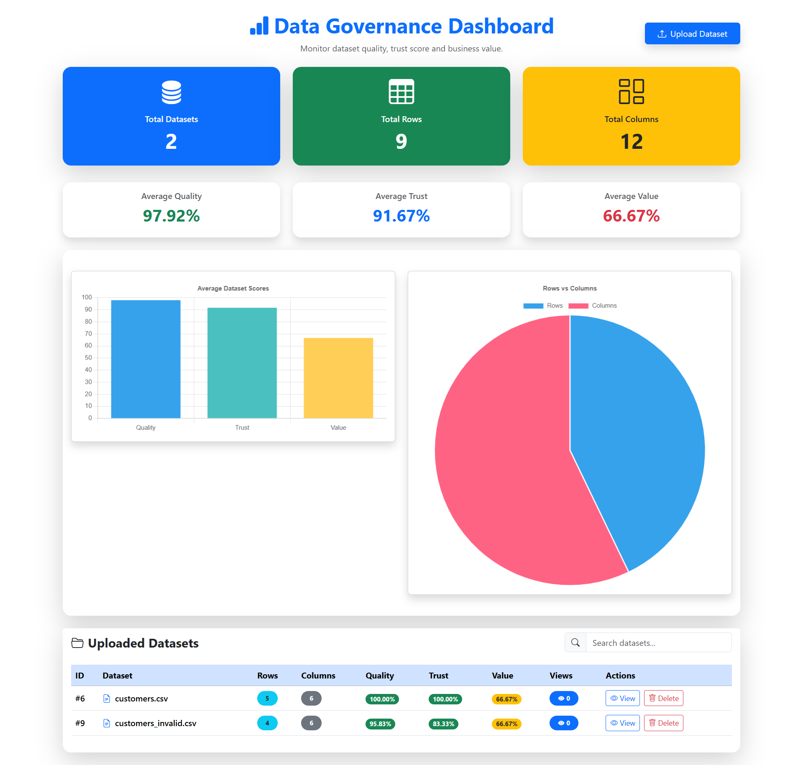
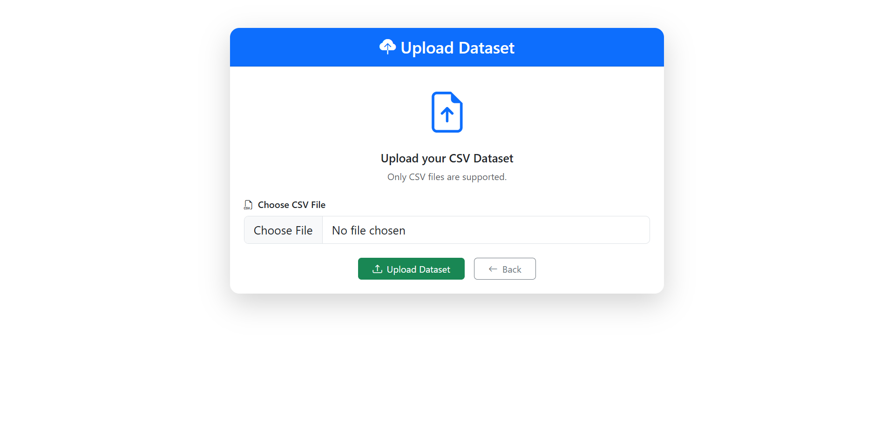

# 📊 Data Governance Dashboard


A full-stack Data Governance Dashboard built using **Spring Boot**, **React.js**, and **MySQL** that allows users to upload datasets, perform automatic profiling, classify sensitive data, and visualize governance metrics through an interactive dashboard.

---


## ⭐ Project Highlights

- Upload CSV datasets
- Automatic column profiling
- Missing and invalid value detection
- Data type inference
- Sensitive data classification
- Quality, Trust and Value score calculation
- Interactive analytics dashboard
- Search and delete datasets
- Manual sensitivity override
- Responsive React UI

## 🚀 Features

### Dataset Management
- Upload CSV datasets
- View uploaded datasets
- Delete datasets
- Search datasets by filename
- View dataset details

### Data Profiling
- Automatic column profiling
- Detect data types
- Missing value analysis
- Invalid value analysis
- Row and column statistics

### Sensitivity Classification
Automatically classifies columns into:

- PUBLIC
- PERSONAL
- PII (Personally Identifiable Information)
- CONFIDENTIAL

Supports manual sensitivity override from the UI.

### Governance Scores

Each uploaded dataset receives:

- Quality Score
- Trust Score
- Value Score

Dashboard also shows average scores across all uploaded datasets.

### Dashboard

- Total datasets
- Total rows
- Total columns
- Average Quality Score
- Average Trust Score
- Average Value Score
- Interactive charts
- Search functionality

### Dataset Details

Displays:

- Dataset information
- Upload timestamp
- View count
- Dataset scores
- Average Missing %
- Average Invalid %
- Column profiling
- Sensitivity classification
- Manual sensitivity update

---

# 🛠 Tech Stack

## Backend

- Java 17
- Spring Boot 3
- Spring Data JPA
- Hibernate
- Maven
- Apache Commons CSV
- MySQL

## Frontend

- React.js
- React Router
- Axios
- Bootstrap 5
- React Toastify
- Chart.js
- React ChartJS 2

## Database

MySQL

---

# 📁 Project Structure

```
data-governance-dashboard
│
├── data-governance-backend
│   ├── controller
│   ├── service
│   ├── repository
│   ├── entity
│   ├── util
│   └── resources
│
├── data-governance-frontend
│   ├── components
│   ├── pages
│   ├── services
│   └── api
│
└── README.md
```

---

# 🏗 Architecture

```
React UI
    │
    ▼
Spring Boot REST APIs
    │
    ▼
Business Services
    │
    ▼
Spring Data JPA
    │
    ▼
MySQL Database
```

---

# 🗄 Database

Database Name

```
data_governance
```

Main Tables

### datasets

Stores uploaded dataset information.

Columns include

- id
- file_name
- upload_time
- row_count
- column_count
- quality_score
- trust_score
- value_score
- view_count

### dataset_columns

Stores profiling information for every column.

Columns include

- id
- column_name
- data_type
- sensitivity_tag
- missing_percentage
- invalid_percentage
- dataset_id

---

# ⚙ Backend Setup

Clone the repository

```bash
git clone https://github.com/rushikesh-babar2001/data-governance-dashboard.git
```

Navigate to backend

```bash
cd data-governance-backend
```

Configure MySQL database in

```
application.properties
```

Run

```bash
mvn spring-boot:run
```

Backend runs on

```
http://localhost:8080
```

---

# ⚙ Frontend Setup

Navigate to frontend

```bash
cd data-governance-frontend
```

Install dependencies

```bash
npm install
```

Run

```bash
npm run dev
```

Frontend runs on

```
http://localhost:5173
```

---

# 📌 REST APIs

## Dashboard

GET

```
/api/dashboard
```

Returns dashboard summary.

---

## Upload Dataset

POST

```
/api/datasets/upload
```

Upload CSV dataset.

---

## Get All Datasets

GET

```
/api/datasets
```

Returns all datasets.

---

## Dataset Details

GET

```
/api/datasets/{id}
```

Returns dataset details.

---

## Dataset Columns

GET

```
/api/datasets/{id}/columns
```

Returns column profiling.

---

## Update Sensitivity

PUT

```
/api/datasets/columns/{columnId}/sensitivity
```

Updates sensitivity tag.

---

## Delete Dataset

DELETE

```
/api/datasets/{id}
```

Deletes a dataset.

---

# 📈 Scoring Logic

### Quality Score

Calculated using missing value percentage.

```
Quality Score = 100 − Average Missing %
```

---

### Trust Score

Calculated using invalid values.

```
Trust Score = 100 − Average Invalid %
```

---

### Value Score

Calculated using number of sensitive columns.

```
Value Score =
(Important Columns / Total Columns) × 100
```

---

# 🧪 Unit Testing

Implemented JUnit tests for utility classes.

Example

- SensitivityUtilTest

---

## 📷 Screenshots

### Dashboard



---

### Upload Dataset



---

### Dataset Details


```

---

# 🔮 Future Enhancements

- Excel (.xlsx) upload
- User authentication
- Role-based access
- Export reports
- Dataset versioning
- Data lineage
- Audit logs
- Docker deployment
- Cloud deployment

---

## 👨‍💻 Author

Rushikesh Babar

Java Full Stack Developer

GitHub:
https://github.com/rushikesh-babar2001
